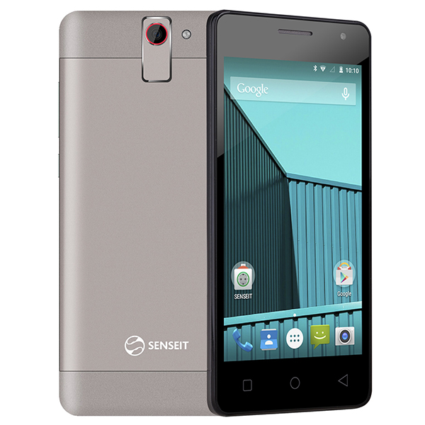

## Linux kernel 3.10.54 (mt6582) for Senseit E400           

Неофициальный! (Официальный недоступен)

Компоненты  | Характеристики
-----------:|:-------------------------
Процессор   | 1.3GHz Quad-Core MT6582M
Графика     | Mali-400MP
ОЗУ         | 1GB RAM
Android     | 5.0
ПЗУ         | 8GB
Аккумулятор | 4050 mAh
Дисплей     | 5" 960x540 px
Камера      | 8MPx

* Работает:
1) Драйвер дисплея (lcm)
2) Тачскрин
3) Hotknot
4) Обе сим карты
5) Наушники
6) Радио
7) Зарядка
8) Акселлерометр
9) Датчик света/приближения
10) Звук
11) Подстветка
12) OTG
13) Главная камера (без интерполяции)
14) Фронтальная камера
15) Фонарик
16) Автофокус
